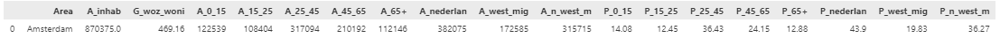

# Fair Sensing Workflow Pipeline

This markdown file documents the end-to-end pipeline for optimizing public transport-based environmental sensing coverage. It shows how we transform raw spatial and temporal data into a strategic deployment plan using modular Python functions.

---

### RAW DATA / PARAMETERS 

# Raw Data CBS andcity
cbs_NL  = gpd.read_file("data/cbs_vk100_2021_vol.gpkg") # downloaded 2024
city_border = gpd.read_file("data/Gemeente2.geojson") # For Amsterdam in this case 

# Raw Data GTFS
df_realtime = pd.read_csv('data/gtfs_realtime_data_12_to_19.csv') # realtime GTFS week
gtfs_zip_path = 'data/gtfs-nl.zip' # static GTFS data

# Paramters
start_ts = pd.Timestamp('2024-03-15 05:30:00') # start time for the analysis
end_ts = pd.Timestamp('2024-03-16 05:29:59') # end time for the analysis
agency = 'GVB' # transport provider
buffer_distance = 50  # Buffer distance in meters

### PROCESS

#  'Cleaning CBS data' # here we had to shorten column names in functio definition


### RAW DATA INPUT: CBS 100x100 NL / CITY BORDER
### DATA OUTPUT: CBS READY GDF FOR CITY 

```python
def process_cbs_data(cbs: gpd.GeoDataFrame, city: gpd.GeoDataFrame) -> tuple[gpd.GeoDataFrame, pd.DataFrame]:
    """
    1. clip_and_filter_cbs_by_city: clip CBS data to city boundary and select relevant columns  
    2. clean_cbs_nan: replace -99997 with NaN and drop rows with NaN in 'aantal_inwoners'  
    3. rename_and_recalculate: rename columns and recalculate A_nederlan, A_west_mig, A_n_west_mig  

    Returns:
    - Cleaned CBS GeoDataFrame
    - NaN summary DataFrame
    """
    filtered = clip_and_filter_cbs_by_city(cbs, city)
    nan_summary, cleaned = clean_cbs_nan(filtered)
    semi_cbs = rename_and_recalculate(cleaned)
    return semi_cbs, nan_summary
```

#  'Final CBS data wrangling' # ## Final FUNCTION 
- For Amsterdam cleaned, filled, predicted, for space - 
- Ready for use

### INPUT DATA: CBS SEMI CLEANED 
### OUTPUT DATA: CBS FULLY CLEANED  

```python
def final_cbs_pipeline(cbs: gpd.GeoDataFrame) -> gpd.GeoDataFrame:
    """
    Pipeline to process CBS data:
    1. Clean and adjust population groups
    2. Impute missing G_woz_woni values
    3. Adjust any remaining negative values
    """
    cbs_clean = clean_and_adjust_cbs(cbs)
    cbs_imputed = impute_woz_with_regression(cbs_clean)
    cbs_full = adjust_negative_values(cbs_imputed)
    return cbs_full
```

# 'Create City Stats' #Creating average sociodemographics for a given city

- Create city stats


```python
def compute_city_stats(cbs_city):
    """
    Compute city-level demographic and housing statistics from CBS data.

    Outputs:
    - Total inhabitants
    - Mean G_woz_woni (property value)
    - Absolute sums for age and migration groups
    - Relative percentages for age and migration groups
    - Returns result as a one-row DataFrame
    """
    total_inhab = cbs_city['A_inhab'].sum()
    mean_woz = round(cbs_city['G_woz_woni'].mean(), 2)

    # absolute sums
    age_cols = ['A_0_15', 'A_15_25', 'A_25_45', 'A_45_65', 'A_65+']
    mig_cols = ['A_nederlan', 'A_west_mig', 'A_n_west_m']
    age_sums = cbs_city[age_cols].sum()
    mig_sums = cbs_city[mig_cols].sum()

    # calculate and round percentages
    pct_age = (age_sums / total_inhab * 100).round(2)
    pct_mig = (mig_sums / total_inhab * 100).round(2)

    stats = pd.DataFrame([{
        'Area': 'Amsterdam',
        'A_inhab': total_inhab,
        'G_woz_woni': mean_woz,
        **age_sums.to_dict(),
        **mig_sums.to_dict(),
        'P_0_15': pct_age['A_0_15'],
        'P_15_25': pct_age['A_15_25'],
        'P_25_45': pct_age['A_25_45'],
        'P_45_65': pct_age['A_45_65'],
        'P_65+': pct_age['A_65+'],
        'P_nederlan': pct_mig['A_nederlan'],
        'P_west_mig': pct_mig['A_west_mig'],
        'P_n_west_m': pct_mig['A_n_west_m'],
    }])

    return stats
  ```





