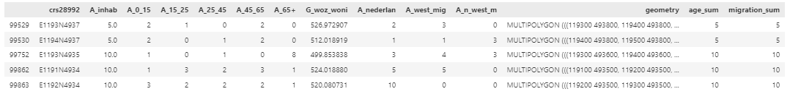
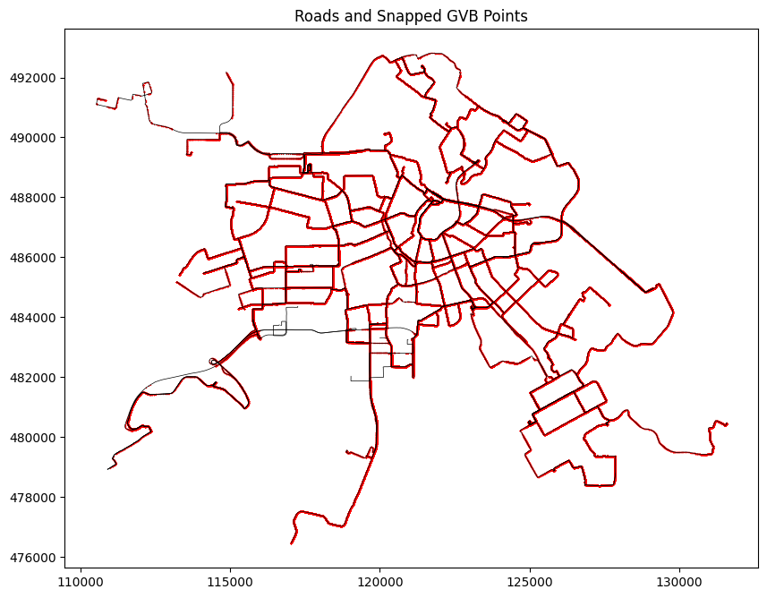

# Fair Sensing Workflow Pipeline

This markdown file documents the end-to-end pipeline for optimizing public transport-based environmental sensing coverage. It shows how we transform raw spatial and temporal data into a strategic deployment plan using modular Python functions.

---

### RAW DATA / PARAMETERS 

# Raw Data CBS andcity
cbs_NL  = gpd.read_file("data/cbs_vk100_2021_vol.gpkg") # downloaded 2024
city_border = gpd.read_file("data/Gemeente2.geojson") # For Amsterdam in this case 

# Raw Data GTFS
df_realtime = pd.read_csv('data/gtfs_realtime_data_12_to_19.csv') # realtime GTFS week
gtfs_zip_path = 'data/gtfs-nl.zip' # static GTFS data

# Paramters
start_ts = pd.Timestamp('2024-03-15 05:30:00') # start time for the analysis
end_ts = pd.Timestamp('2024-03-16 05:29:59') # end time for the analysis
agency = 'GVB' # transport provider
buffer_distance = 50  # Buffer distance in meters

### PROCESS

#  'Cleaning CBS data' # here we had to shorten column names in functio definition


### RAW DATA INPUT: CBS 100x100 NL / CITY BORDER
### DATA OUTPUT: CBS READY GDF FOR CITY 

```python
def process_cbs_data(cbs: gpd.GeoDataFrame, city: gpd.GeoDataFrame) -> tuple[gpd.GeoDataFrame, pd.DataFrame]:
    """
    1. clip_and_filter_cbs_by_city: clip CBS data to city boundary and select relevant columns  
    2. clean_cbs_nan: replace -99997 with NaN and drop rows with NaN in 'aantal_inwoners'  
    3. rename_and_recalculate: rename columns and recalculate A_nederlan, A_west_mig, A_n_west_mig  

    Returns:
    - Cleaned CBS GeoDataFrame
    - NaN summary DataFrame
    """
    filtered = clip_and_filter_cbs_by_city(cbs, city)
    nan_summary, cleaned = clean_cbs_nan(filtered)
    semi_cbs = rename_and_recalculate(cleaned)
    return semi_cbs, nan_summary
```

#  'Final CBS data wrangling' # ## Final FUNCTION 
- For Amsterdam cleaned, filled, predicted, for space - 
- Ready for use

### INPUT DATA: CBS SEMI CLEANED 
### OUTPUT DATA: CBS FULLY CLEANED  

```python
def final_cbs_pipeline(cbs: gpd.GeoDataFrame) -> gpd.GeoDataFrame:
    """
    Pipeline to process CBS data:
    1. Clean and adjust population groups
    2. Impute missing G_woz_woni values
    3. Adjust any remaining negative values
    """
    cbs_clean = clean_and_adjust_cbs(cbs)
    cbs_imputed = impute_woz_with_regression(cbs_clean)
    cbs_full = adjust_negative_values(cbs_imputed)
    return cbs_full
```



# 'Create City Stats' #Creating average sociodemographics for a given city

- Create city stats


```python
def compute_city_stats(cbs_city):
    """
    Compute city-level demographic and housing statistics from CBS data.

    Outputs:
    - Total inhabitants
    - Mean G_woz_woni (property value)
    - Absolute sums for age and migration groups
    - Relative percentages for age and migration groups
    - Returns result as a one-row DataFrame
    """
    total_inhab = cbs_city['A_inhab'].sum()
    mean_woz = round(cbs_city['G_woz_woni'].mean(), 2)

    # absolute sums
    age_cols = ['A_0_15', 'A_15_25', 'A_25_45', 'A_45_65', 'A_65+']
    mig_cols = ['A_nederlan', 'A_west_mig', 'A_n_west_m']
    age_sums = cbs_city[age_cols].sum()
    mig_sums = cbs_city[mig_cols].sum()

    # calculate and round percentages
    pct_age = (age_sums / total_inhab * 100).round(2)
    pct_mig = (mig_sums / total_inhab * 100).round(2)

    stats = pd.DataFrame([{
        'Area': 'Amsterdam',
        'A_inhab': total_inhab,
        'G_woz_woni': mean_woz,
        **age_sums.to_dict(),
        **mig_sums.to_dict(),
        'P_0_15': pct_age['A_0_15'],
        'P_15_25': pct_age['A_15_25'],
        'P_25_45': pct_age['A_25_45'],
        'P_45_65': pct_age['A_45_65'],
        'P_65+': pct_age['A_65+'],
        'P_nederlan': pct_mig['A_nederlan'],
        'P_west_mig': pct_mig['A_west_mig'],
        'P_n_west_m': pct_mig['A_n_west_m'],
    }])

    return stats
  ```


# 'Merge and Interpolate Static and Realtime Data' # merge interpolate static and realtime, lines/vehicles statistics for 5 seconds intervals 

### RAW DATA INPUT: GTFS NL STATIC 
### RAW DATA INPUT: GTFS REALTIME NL (e.g. FOR ONE WEEK)
### DATA OUTPUT: GTFS REALTIME MERGED FOR ONE AGENCY (e.g. GVB)

```python
def process_gtfs_pipeline(gtfs_realtime_df: pd.DataFrame, gtfs_zip_path: str,
                                    start_timestamp: pd.Timestamp, end_timestamp: pd.Timestamp,
                                    agency_id: str = 'GVB') -> tuple[gpd.GeoDataFrame, pd.DataFrame, pd.Series, pd.DataFrame]:
    """
    Complete in-memory GTFS pipeline:
    1. Filter GTFS real-time to one day and print stats
    2. Merge real-time GTFS with static routes.txt
    3. Filter by agency and route_type
    4. Split on GPS jumps
    5. Interpolate GPS traces


    Parameters:
    - gtfs_realtime_df : full GTFS real-time DataFrame
    - gtfs_zip_path    : static GTFS zip file path
    - start_timestamp  : e.g. pd.Timestamp('2024-03-15 05:30:00')
    - end_timestamp    : e.g. pd.Timestamp('2024-03-16 05:29:59')
    - agency_id        : GTFS agency_id to include (default 'GVB')

    Returns:
    - final_gdf        : GeoDataFrame in EPSG:28992
    - unique_day       : np.ndarray of dates
    - points_per_day   : pd.Series of counts per date
    - min_max_per_day  : pd.DataFrame with min/max per date
    """
    # 1. Filter real-time GTFS and print date info
    unique_day, points_per_day, min_max_per_day, filtered_realtime = filter_gtfs_realtime(
        gtfs_realtime_df, start_timestamp, end_timestamp
    )

    # 2. Merge with static and filter agency/route_type
    gdf_gvb = enrich_and_filter_gtfs_data(filtered_realtime, gtfs_zip_path, agency_id_filter=agency_id)

    # 3. Split traces by GPS jumps
    gdf_gvb = apply_split_and_count_route_types(gdf_gvb)

    # 4. Interpolate traces
    interpolated_df = run_interpolation_on_traces(gdf_gvb)

    final_gdf = interpolated_df.copy() 

    return final_gdf, unique_day, points_per_day, min_max_per_day
```

# 'Crate Public Transport Lines' # # create public lines from GTFS data

### RAW DATA INPUT: GTFS NL STATIC 
### DATA OUTPUT: PUBLIC TRANSPORT LINES AGENCY / TYPE (e.g. GVB, bus, tram)

```python

# Description: Reads GTFS zip, builds shape LineStrings, merges with trips/routes, filters by agency,
#              and returns GeoDataFrames for tram, bus, night-bus, and all public transport.

def extract_public_lines(gtfs_zip_path: str, agency_id: str = 'GVB'):
    # 1) Read GTFS static files from zip
    with ZipFile(gtfs_zip_path) as z:
        df_shapes = pd.read_csv(z.open("shapes.txt"), dtype={
            'shape_id': 'str',
            'shape_pt_lat': 'float',
            'shape_pt_lon': 'float',
            'shape_pt_sequence': 'Int64',
            'shape_dist_traveled': 'float',
        })
        df_routes = pd.read_csv(z.open("routes.txt"), dtype={
            'route_id': 'str',
            'agency_id': 'str',
            'route_short_name': 'str',
            'route_long_name': 'str',
            'route_desc': 'str',
            'route_type': 'Int64',
            'route_color': 'str',
            'route_text_color': 'str',
            'exact_times': 'bool'
        })
        df_trips = pd.read_csv(z.open("trips.txt"), dtype={
            'route_id': 'str',
            'service_id': 'str',
            'trip_id': 'str',
            'shape_id': 'str',
            'trip_headsign': 'str',
            'direction_id': 'str',
            'block_id': 'str',
            'wheelchair_accessible': 'str',
            'route_direction': 'str',
            'trip_note': 'str',
            'bikes_allowed': 'str'
        })

    # 2) Build GeoDataFrame of shapes
    df_shapes['geometry'] = gpd.points_from_xy(df_shapes['shape_pt_lon'], df_shapes['shape_pt_lat'])
    # group into LineStrings per shape_id
    grouped = df_shapes.groupby('shape_id')['geometry'].agg(list)
    grouped = grouped[grouped.map(len) > 1].to_frame()
    grouped['geometry'] = grouped['geometry'].apply(LineString)
    gdf_shapes = gpd.GeoDataFrame(grouped, geometry='geometry', crs="EPSG:4326")
    # reproject to RD New
    gdf_shapes = gdf_shapes.to_crs("EPSG:28992")

    # 3) Prepare route info
    df_route_meta = df_routes[['route_id','route_type','route_short_name','agency_id']].drop_duplicates()
    df_trip_meta = df_trips[['route_id','shape_id']].drop_duplicates()
    df_trip_meta = df_trip_meta.merge(df_route_meta, on='route_id', how='left')

    # 4) Merge shapes with trip metadata
    gdf = gdf_shapes.merge(df_trip_meta, left_index=True, right_on='shape_id', how='left')

    # 5) Filter for agency and modes
    gdf_agency = gdf[gdf['agency_id'] == agency_id]

    # tram: route_type == 0
    tram_gdf = gdf_agency[gdf_agency['route_type'] == 0]
    tram_unique = tram_gdf.drop_duplicates(subset='route_short_name').reset_index(drop=True)

    # bus: route_type == 3
    bus_gdf = gdf_agency[gdf_agency['route_type'] == 3]
    bus_unique = bus_gdf.drop_duplicates(subset='route_short_name').reset_index(drop=True)

    # night bus: short_name startswith 'N'
    bus_night_unique = bus_unique[bus_unique['route_short_name'].str.startswith('N')].reset_index(drop=True)

    # day bus: the rest
    bus_day_unique = bus_unique[~bus_unique['route_short_name'].str.startswith('N')].reset_index(drop=True)

    # public transport = trams + all buses
    public_transport = pd.concat([tram_unique, bus_unique], ignore_index=True)

    return public_transport, tram_unique, bus_unique, bus_day_unique, bus_night_unique

```


# 'Snap Realtime Data Points' # # snap points to lines / routes

#### INPUT DATA: Public Transport Data Lines City 
#### INPUT DATA: Interpolated Realtime Data Agency Time 
#### OUTPUT DATA: Snapped Realtime Data Agency Time

```python

def snap_interpolated_points_to_routes(routes_gdf: gpd.GeoDataFrame, interpolated_gdf: gpd.GeoDataFrame) -> gpd.GeoDataFrame:
    """
    Snap interpolated GTFS points (buses and trams) to their nearest GVB route lines in Amsterdam.

    Parameters:
    - routes_gdf         : GeoDataFrame of public transport routes (must include 'route_type')
    - interpolated_gdf   : GeoDataFrame of interpolated GTFS points (must include 'route_type', 'geometry')

    Returns:
    - GeoDataFrame of snapped GTFS points (deduplicated), projected in same CRS as routes_gdf
    """

    # Reproject interpolated data to match routes CRS
    interpolated_gdf = interpolated_gdf.to_crs(routes_gdf.crs)

    # Split by mode
    interpolated_trams = interpolated_gdf[interpolated_gdf['route_type'] == 0]
    interpolated_buses = interpolated_gdf[interpolated_gdf['route_type'] == 3]

    routes_trams = routes_gdf[routes_gdf['route_type'] == 0]
    routes_buses = routes_gdf[routes_gdf['route_type'] == 3]

    # Plot raw data
    fig, ax = plt.subplots(figsize=(10, 10))
    routes_gdf.plot(ax=ax, color='black', linewidth=0.5)
    interpolated_gdf.plot(ax=ax, color='red', linewidth=0.5, markersize=0.2)
    plt.title('Routes and Interpolated GTFS Points')

    def snap_points(points_gdf, lines_gdf):
        joined = gpd.sjoin_nearest(points_gdf, lines_gdf, how="inner", distance_col="dist")
        snapped = []
        for i, row in joined.iterrows():
            if (i + 1) % 1000 == 0:
                print(f"Processed {i + 1} values")
            road = lines_gdf.loc[int(row['index_right'])].geometry
            proj = road.project(row.geometry)
            snapped_point = road.interpolate(proj)
            snapped.append(snapped_point)
        joined['geometry'] = snapped
        return joined.drop(columns=['index_right', 'dist'])

    # Snap trams
    final_trams = snap_points(interpolated_trams, routes_trams)
    final_trams = final_trams[['new_timest', 'new_lat', 'new_lon', 'uni_id', 'route_id_left', 'trip_id', 'route_type_left', 'geometry']]

    # Snap buses
    final_buses = snap_points(interpolated_buses, routes_buses)
    final_buses = final_buses[['new_timest', 'new_lat', 'new_lon', 'uni_id', 'route_id_left', 'trip_id', 'route_type_left', 'geometry']]

    # Combine
    snapped = gpd.GeoDataFrame(pd.concat([final_buses, final_trams], ignore_index=True), crs=routes_gdf.crs)

    # Drop duplicates
    snapped = snapped.drop_duplicates(subset=['new_lat', 'new_lon', 'new_timest', 'uni_id'], keep='first')

    # Plot snapped
    fig, ax = plt.subplots(figsize=(10, 10))
    routes_gdf.plot(ax=ax, color='black', linewidth=0.5)
    snapped.plot(ax=ax, color='red', linewidth=0.5, markersize=0.2)
    plt.title('Roads and Snapped GTFS Points')

    return snapped

```





