# Optimization Pipeline {Workflow 02}

This markdown file documents the end-to-end pipeline for optimizing public transport-based environmental sensing. It identifies the best vehicles for different optimization goals (spatial, temporal, fairness, etc.) and visualizes the outputs. Parameters such as start time, end time, agency, and buffer distances are already set in the preprocessed data.

---

## RAW / PREPROCESSED DATA & PARAMETERS

### 📊 Preprocessed Data: Sociodemographics (CBS)  
**File**: `data/temp/full_cbs.gpkg`  
**Note**: Contains 100×100m population grid, cleaned and filtered for Amsterdam  

### 📊 Preprocessed Data: City Stats  
**File**: `data/city_stats_amsterdam.csv`  
**Note**: Aggregated indicators for the whole city (migration, WOZ, age, etc.)  

### 🗺️ Raw Data: City Border (Amsterdam)  
**File**: `data/Gemeente2.geojson`  
**Use**: Defines the administrative boundary of Amsterdam  

### 🚍 Preprocessed Data: Grouped GTFS Realtime Points  
- **File**: `data/temp/grouped_by_points_GVB.gpkg`  
- **Note**: GTFS points grouped with CBS cells, for 1/3/7 day intervals  

### ⚙️ Parameters  
- **Number of vehicles**: e.g. 10  
- **Analysis duration**: 1 / 3 / 7 days  

---

# PROCESS

## 🧠 Create Vehicles with Sociodemographic Stats

- Combine CBS data with grouped realtime points  
- Calculate per-vehicle statistics for population, housing, and migration  

#### 📥 INPUT DATA: Grouped GTFS Points, CBS Full  
#### 📤 OUTPUT DATA: GeoDataFrame of Vehicles with Statistics  

```python
def prepare_vehicles_with_stats(points_grouped, cbs_full):
    """
    Full pipeline:
    1. Creates vehicle-level GeoDataFrame from grouped points.
    2. Enriches with CBS statistics and route types.

    Parameters:
    - points_grouped : GeoDataFrame grouped by 'uni_id' with 'route_type' and other data.
    - cbs_full       : CBS GeoDataFrame with 'crs28992' and demographic data.

    Returns:
    - vehicles_stats : GeoDataFrame enriched with CBS data and route_type.
    """
    # .....
    return vehicles_stats
```
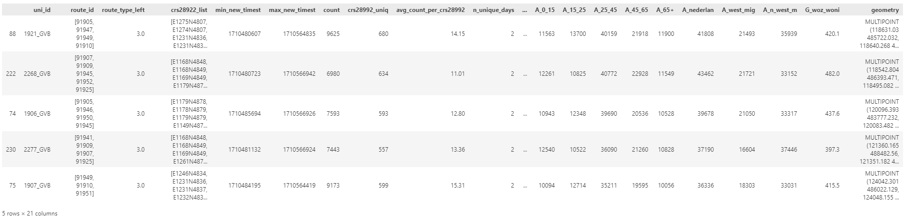
---

## 🌍 Spatial Optimization

- Select vehicles that **cover the most unique CBS cells**  
- Prioritize spatial diversity (heuristic-based selection)

#### 📥 INPUT DATA: Grouped Points with CBS, CBS Full, Vehicle Stats  
#### 📤 OUTPUT DATA: Optimized Spatial Vehicle List & GDF

```python
def spatial_optimization_pipeline(points_gdf, cbs_gdf, vehicles_df, coverage_threshold=3, top_n=10):
    """
    Full pipeline for spatial optimization:
    1. Prepares unique vehicle coverage.
    2. Selects vehicles to maximize CBS cell coverage.
    3. Extracts top-N optimized vehicles.
    4. Returns a one-column DataFrame ('max_spatial') listing the selected vehicle IDs.

    Parameters:
    - points_gdf          : GeoDataFrame of measurement points.
    - cbs_gdf             : CBS GeoDataFrame with 'crs28992' and geometry.
    - vehicles_df         : GeoDataFrame of vehicles with 'uni_id'.
    - coverage_threshold  : Minimum coverage increase to continue selection.
    - top_n               : Number of top optimized vehicles to select.

    Returns:
    - optimized_ids       : List of selected vehicle IDs.
    - filtered_vehicles   : GeoDataFrame of the selected vehicles.
    - df_max_spatial      : DataFrame with one column ('max_spatial') listing selected vehicle IDs.
    """
    # .....
    return optimized_ids, filtered_vehicles, df_max_spatial
```
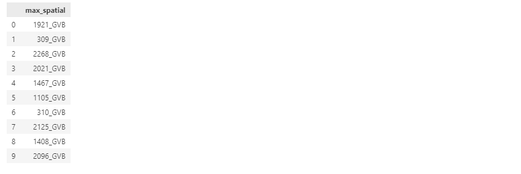

---

## ⏱️ Temporal Optimization

- Maximize **average frequency** (measurements per CBS cell per 24h)  

#### 📥 INPUT DATA: Vehicles Stats  
#### 📤 OUTPUT DATA: Optimized Temporal Vehicle List & GDF  

```python
def temporal_optimization_pipeline(gdf_vehicles, top_n=10):
    """
    Runs full temporal optimization pipeline.

    Inputs:
    - gdf_vehicles: GeoDataFrame of vehicles
    - top_n: number of top temporal vehicles to select

    Returns:
    - optimized_ids: list of top N selected uni_ids
    - top_vehicles: GeoDataFrame of those vehicles
    - df_max_temporal: DataFrame with one column 'max_temporal'
    """
    # .....
    return optimized_ids, top_vehicles, df_max_temporal
```

---

## ⚖️ Fairness Optimization

- Select vehicles whose stats are **closest to the city average**  
- Optimize different methods - closest (simple), relative (percentages), absolute (percentages and weighted values according to population)  
- Different results - currently used the relative method

#### 📥 INPUT DATA: City Stats, Vehicles Stats  
#### 📤 OUTPUT DATA:  
- Fairness DataFrame (closest/relative/absolute)  
- Optimized Fairness Vehicle List  
- Fairness Subset GDF

 ```python
def run_fairness_pipeline(gdf, ams_gdf, n=10):
    """
    Executes the full fairness workflow in the correct order, using the same top-N for all three methods.

    Parameters:
    - gdf     : GeoDataFrame with vehicle % columns
    - ams_gdf : GeoDataFrame with Amsterdam stats
    - n       : number of top vehicles to select for simple, relative, and absolute optimization

    Returns:
    - df_area_statistics : DataFrame comparing area-level stats
    - df_optimizations   : Full list of IDs per optimization type
    - df_vehicle_ids     : Top-N vehicle IDs side-by-side
    """
    # .....
    return closest_simple, closest_relative, closest_absolute, df_area_statistics, df_optimizations, df_vehicle_ids
```
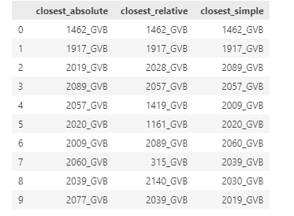

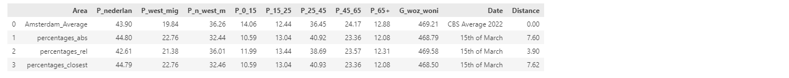


---

## 👥 Population-Specific Optimizations

- Optimize vehicles based on demographic coverage

### 📊 Types of Population Prioritization:
- Max **Total Population** (unique)
- Max **Elderly (Age > 65)**  
- Max **Young (Age < 15)**  
- Max **Dutch population**  
- Max **Non-Western migrants**  
- Max **Non-Western %**  
- Max **Old Age %**  
- Max **Measurement Counts**

#### 📥 INPUT DATA: CBS Full, Vehicle Stats  
#### 📤 OUTPUT DATA:  
- Optimized Vehicle Lists per Category  
- Vehicle Subsets per Optimization  
- Unique counts per group (e.g. `A_inhab`, `P_65+`)

```python
def run_max_coverage_pipeline(
    gdf: gpd.GeoDataFrame,
    cbs_gdf: gpd.GeoDataFrame,
    n: int = 10
):
    """
    1) Compute top-n vehicles per max_* metric
    2) Analyze CBS coverage for each top-n set
    3) Build a summary table of uni_id selections

    Parameters:
      - gdf     : vehicles GeoDataFrame
      - cbs_gdf : CBS cells GeoDataFrame with 'crs28992' and A_* columns
      - n       : number of top vehicles to pick for each metric

    Returns:
      - tops           : dict of GeoDataFrames (one per 'max_*')
      - cbs_lists      : dict of lists of crs28992 codes
      - max_number     : dict of summed totals
      - gdf_filtered   : dict of filtered CBS GeoDataFrames
      - summary_df     : DataFrame, rows = rank, cols = 'max_*' with uni_id
    """
    # .....
    return tops, cbs_lists, max_number, gdf_filtered, summary_df
```
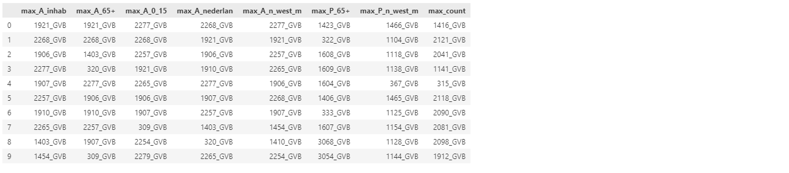
---

## 🔀 Merge All Optimizations

- Combine all optimization types into a **single overview DataFrame**  
- Compare selected vehicles to the entire dataset and city-wide averages  

#### 📥 INPUT DATA:  
- CBS Full  
- Vehicle Stats  
- Amsterdam City Stats  
- Selected Vehicles from all Optimizations  

#### 📤 OUTPUT DATA: Combined Stats Comparison Table  

```python
def vehicle_optimization_pipeline(
    gdf,
    cbs,
    ams_stats,
    max_space_vehicles,
    max_pop_vehicles,
    fair_vehicles,
    combined_vehicles,
    random_vehicles
):
    """
    Full pipeline for computing and comparing vehicle optimization strategies.

    Parameters:
        gdf                : GeoDataFrame of vehicles
        cbs                : GeoDataFrame of CBS grid
        ams_stats          : DataFrame of Amsterdam statistics
        max_space_vehicles : DataFrame with 'max_spatial' column
        max_pop_vehicles   : DataFrame with 'max_point_count' column
        fair_vehicles      : DataFrame with 'fairest_' columns
        combined_vehicles  : DataFrame with 'combined_opt' column
        random_vehicles    : DataFrame with 'random' column

    Returns:
        final_df_cells     : Final summary DataFrame
    """
    # Process vehicles
    gdf_p = calculate_percentages_from_vehicles(gdf)

    # Combine all strategy outputs
    combined_df = create_combined_vehicle_df(
        max_space_vehicles,
        max_pop_vehicles,
        fair_vehicles,
        combined_vehicles,
        random_vehicles
    )

    return final_df_cells

    # .....
```
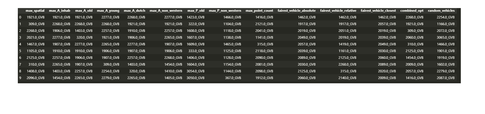
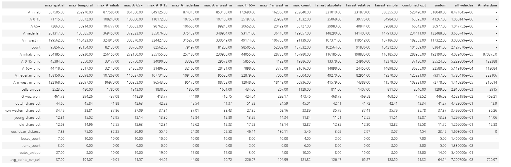

### 📸 Quick Visual Insights

- Generate visual snapshots of optimized vehicles per strategy  
- Includes: bar charts, spatial maps, radar/spider plots

 ```python
def plot_vehicles_by_group(gdf, lists_dict, geo_boundary, color='#9EC043', alpha=0.7, markersize=0.1):
    """
    Plots subsets of vehicles based on lists_dict.
    
    Parameters:
    - gdf: GeoDataFrame of all vehicles with 'uni_id'.
    - lists_dict: dict {group_name: [uni_id, ...]}.
    - geo_boundary: GeoDataFrame for the boundary.
    - color, alpha, markersize: plotting parameters.
    """
    # .....
        plt.show()
```

📷
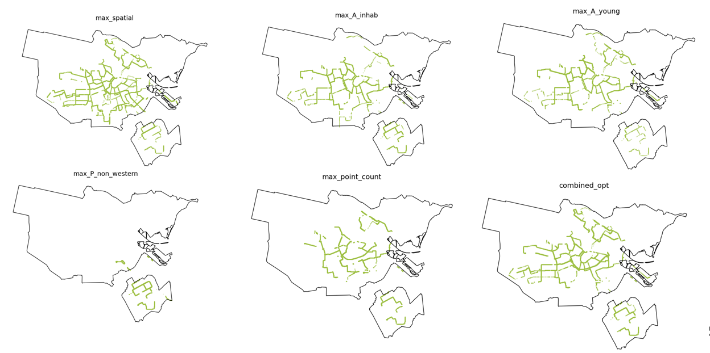
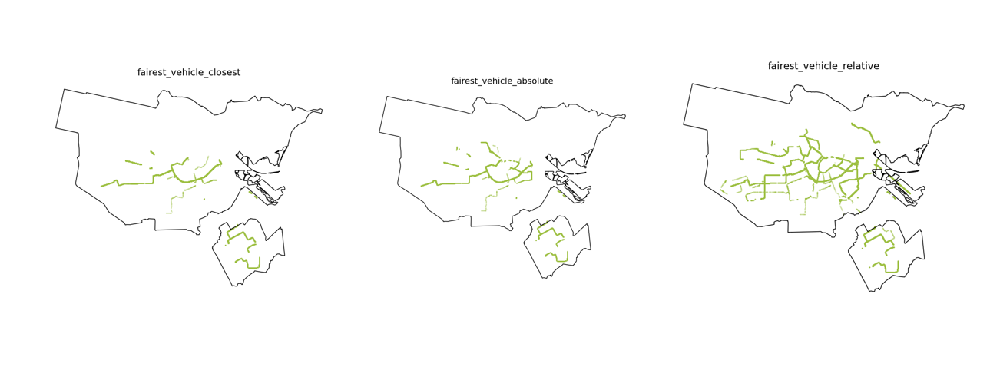
---

## 🚍 Prepare Optimized Vehicles for Visualization

- Build one GeoDataFrame for selected vehicles across all optimization strategies  
- Attach optimization labels for final visual analysis  

#### 📥 INPUT DATA: Optimized Vehicle Lists, Vehicles Stats GDF  
#### 📤 OUTPUT DATA: Final GDF for Visualisation  

```python
def prepare_selected_vehicles_from_combined(
    gdf: gpd.GeoDataFrame,
    combined_df: pd.DataFrame,
    column: str
) -> gpd.GeoDataFrame:
    """
    Filters and prepares a GeoDataFrame of selected vehicles using a column from combined_df.

    Parameters:
    - gdf         : Full GeoDataFrame of vehicles.
    - combined_df : DataFrame with selection columns (e.g., combined strategies).
    - column      : Column name in combined_df to use as selection list (e.g., 'max_spatial').

    Returns:
    - GeoDataFrame with percentage columns computed.
    """
    selected_ids = combined_df[column].dropna().astype(str).tolist()

    # Age percentages
    age_cols = ["A_0_15", "A_15_25", "A_25_45", "A_45_65", "A_65+"]
    for col in age_cols:
        pct_col = f"P_{col.split('_')[1]}" if col != "A_65+" else "P_65+"
        gdf[pct_col] = (gdf[col] / gdf["A_inhab"] * 100).round(2)

    # Migration group percentages
    mig_map = {
        "A_nederlan": "P_nederlan",
        "A_west_mig": "P_west_mig",
        "A_n_west_m": "P_n_west_m"
    }
    for a_col, p_col in mig_map.items():
        gdf[p_col] = (gdf[a_col] / gdf["A_inhab"] * 100).round(2)

    # Reorder geometry to the end
    gdf = gdf[[c for c in gdf.columns if c != "geometry"] + ["geometry"]]

    # .....
    return gdf[gdf["uni_id"].astype(str).isin(selected_ids)].copy()
```


## 🧪 Master Function: Final Analysis + Visualisation

### 🔧 Function Analysis
- Inputs: Transport lines, CBS data  
- Steps: Buffering, spatial join, stat summary

```python
def master_function_analysis(transport_filepath, cbs_filepath, buffer_distance, line_number=None, transport_type=None, crs='EPSG:28992'):
    """
    Master function to handle the entire process from reading data to generating comparison statistics.

    """
    # .....
    
    return sums_df, cbs_gdf, joined_gdf, average_stats
```

### 🧪 Function: Visualisation
- Inputs: Amsterdam border, joined CBS + vehicle buffers  
- Outputs:  
  - **fig1**: Map of covered area  
  - **fig2**: Bar chart of absolute/relative stats  
  - **fig3**: Percentage-point difference  
  - **fig4**: Pie chart of share vs. city

```python
def visualization_master_function(transport_filepath, cbs_gdf, joined_gdf, ams_gdf, buffer_distance, sums_df, average_stats, transport_type=None, line_number=None):
    """
    Master function for visualizing data comparisons.

    """
    # .....
    return fig1, fig2, fig3, fig4
```

#### 📥 INPUT DATA:  
- City Border  
- Selected Vehicle Buffers  
- CBS Full  
- Stats Comparison  

#### 📤 OUTPUT DATA: `fig1` to `fig4` for final visualization  

```python
# call analysis
sums_df, cbs_gdf, joined_gdf, average_stats = master_function_analysis(
    gpd_vehicles, cbs_filepath, buffer_distance)
# call visualization
fig1, fig2, fig3, fig4 = visualization_master_function(
    gpd_vehicles, cbs_gdf, joined_gdf, ams_gdf, buffer_distance, sums_df, average_stats)
```
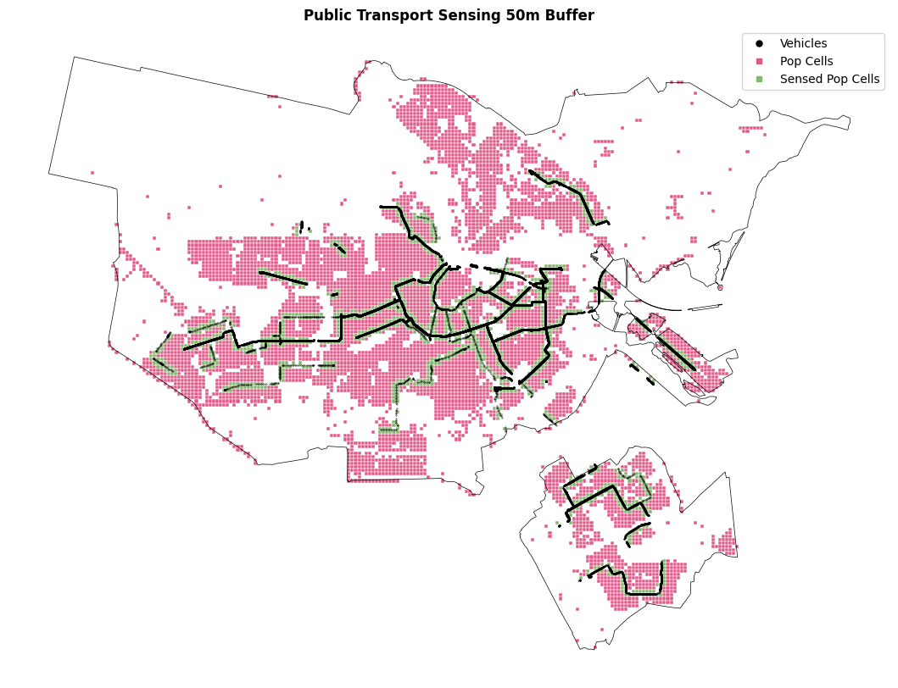
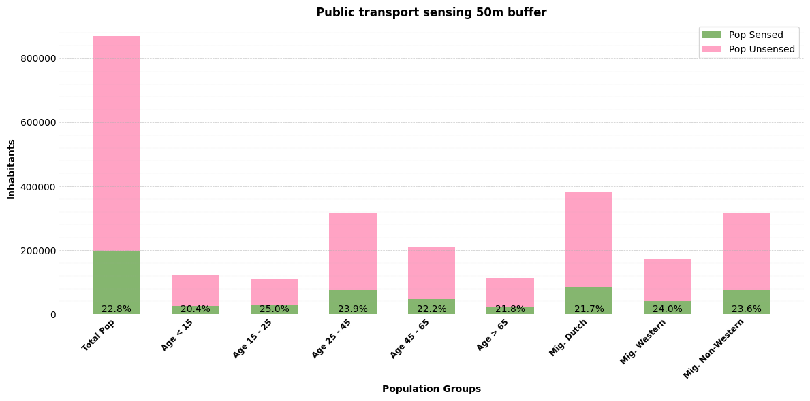
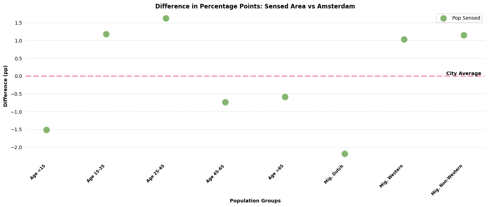
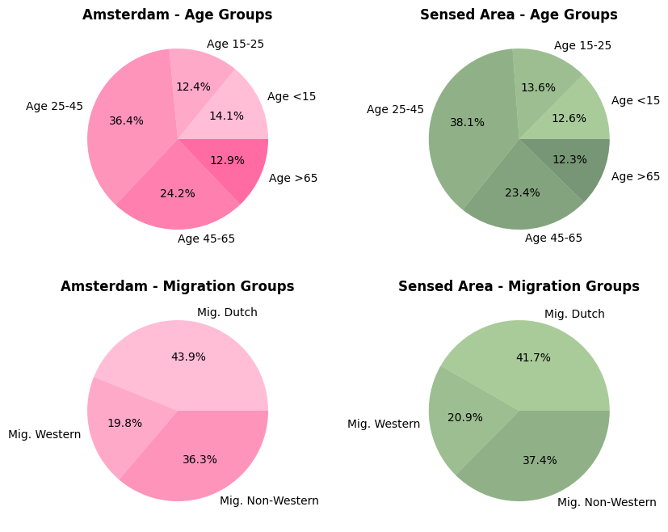

---

🎯 *Next step: deploy the same pipeline for multiple days and add frequencies pipeline {Workflow 3}
