# Fair Sensing Workflow Pipeline

This markdown file documents the end-to-end pipeline for optimizing public transport-based environmental sensing coverage. It shows how we transform raw spatial and temporal data into a strategic deployment plan using modular Python functions.

---

## RAW DATA & PARAMETERS

### 📊 Raw Data: Sociodemographics (CBS)  
**File**: `data/cbs_vk100_2021_vol.gpkg`  
**Note**: Contains 100×100m population grid, downloaded in 2024

### 🗺️ Raw Data: City Border (Amsterdam)  
**File**: `data/Gemeente2.geojson`  
**Use**: Defines the administrative boundary of Amsterdam  

### 🚍 Raw Data: GTFS (Public Transport)  
- **Realtime data**: `data/gtfs_realtime_data_12_to_19.csv` # covers one week of transit vehicle positions and route definitions.
- **Static GTFS**: `data/gtfs-nl.zip`  

### ⚙️ Parameters  
- **Start time**: e.g. 15 March 2024, 05:30  
- **End time**: e.g. 16 March 2024, 05:29  
- **Agency**: e.g. GVB (Amsterdam public transport)  # local transport provider 
- **Buffer distance**: e.g. 50 meters # distance for sensing 


---

# PROCESS

## 🧹 'Cleaning CBS Data'

- Clip the national CBS 100×100 grid to the Amsterdam city boundary  
- Replace invalid values (e.g. `-99997`) and remove missing data  
- Rename columns and recalculate key demographic groups (migration and age groups)

#### 📥 RAW DATA INPUT: CBS 100×100 NL / City Border  
#### 📤 DATA OUTPUT: Cleaned CBS GeoDataFrame for Amsterdam  

```python
def process_cbs_data(cbs: gpd.GeoDataFrame, city: gpd.GeoDataFrame) -> tuple[gpd.GeoDataFrame, pd.DataFrame]:
    """
    1. clip_and_filter_cbs_by_city: clip CBS data to city boundary and select relevant columns  
    2. clean_cbs_nan: replace -99997 with NaN and drop rows with NaN in 'aantal_inwoners'  
    3. rename_and_recalculate: rename columns and recalculate A_nederlan, A_west_mig, A_n_west_mig  

    Returns:
    - Cleaned CBS GeoDataFrame
    - NaN summary DataFrame
    """
    # ...
    # ...
    # ...
    return semi_cbs, nan_summary
```

##  'Final CBS data wrangling' 
- For Amsterdam cleaned, filled, predicted, for space - 
- Ready for use

### INPUT DATA: CBS SEMI CLEANED 
### OUTPUT DATA: CBS FULLY CLEANED  

```python
def final_cbs_pipeline(cbs: gpd.GeoDataFrame) -> gpd.GeoDataFrame:
    """
    Pipeline to process CBS data:
    1. Clean and adjust population groups
    2. Impute missing G_woz_woni values
    3. Adjust any remaining negative values
    """
    # ...
    # ...
    # ...
    return cbs_full
```

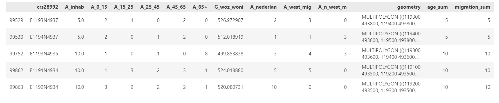

## 'Create City Stats' 

- Creating average sociodemographics for a given city
- Create city stats
  
### INPUT DATA: CBS FULLY CLEANED  

```python
def compute_city_stats(cbs_city):
    """
    Compute city-level demographic and housing statistics from CBS data.

    Outputs:
    - Total inhabitants
    - Mean G_woz_woni (property value)
    - Absolute sums for age and migration groups
    - Relative percentages for age and migration groups
    - Returns result as a one-row DataFrame
    """
    # ...
    # ...
    # ...

    return stats
  ```
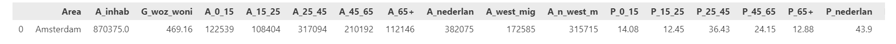


## 'Merge and Interpolate Static and Realtime Data'

- Merge interpolate static and realtime, lines/vehicles statistics for 5 seconds intervals 

### RAW DATA INPUT: GTFS NL STATIC 
### RAW DATA INPUT: GTFS REALTIME NL (e.g. FOR ONE WEEK)
### DATA OUTPUT: GTFS REALTIME MERGED FOR ONE AGENCY (e.g. GVB)

```python
def process_gtfs_pipeline(gtfs_realtime_df: pd.DataFrame, gtfs_zip_path: str,
                                    start_timestamp: pd.Timestamp, end_timestamp: pd.Timestamp,
                                    agency_id: str = 'GVB') -> tuple[gpd.GeoDataFrame, pd.DataFrame, pd.Series, pd.DataFrame]:
    """
    Complete in-memory GTFS pipeline:
    1. Filter GTFS real-time to one day and print stats
    2. Merge real-time GTFS with static routes.txt
    3. Filter by agency and route_type
    4. Split on GPS jumps
    5. Interpolate GPS traces


    Parameters:
    - gtfs_realtime_df : full GTFS real-time DataFrame
    - gtfs_zip_path    : static GTFS zip file path
    - start_timestamp  : e.g. pd.Timestamp('2024-03-15 05:30:00')
    - end_timestamp    : e.g. pd.Timestamp('2024-03-16 05:29:59')
    - agency_id        : GTFS agency_id to include (default 'GVB')

    Returns:
    - final_gdf        : GeoDataFrame in EPSG:28992
    - unique_day       : np.ndarray of dates
    - points_per_day   : pd.Series of counts per date
    - min_max_per_day  : pd.DataFrame with min/max per date
    """
    # ...
    # ...
    # ...

    return final_gdf, unique_day, points_per_day, min_max_per_day
```

## 'Crate Public Transport Lines' 

- Create public lines from GTFS data

### RAW DATA INPUT: GTFS NL STATIC 
### DATA OUTPUT: PUBLIC TRANSPORT LINES AGENCY / TYPE (e.g. GVB, bus, tram)

```python

# Description: Reads GTFS zip, builds shape LineStrings, merges with trips/routes, filters by agency,
#              and returns GeoDataFrames for tram, bus, night-bus, and all public transport.

def extract_public_lines(gtfs_zip_path: str, agency_id: str = 'GVB'):
 """
    1 Read GTFS static files from zip
    2 Build GeoDataFrame of shapes
    3 Prepare route info
    4 Merge shapes with trip metadata
    5 Filter for agency and modes
 """
    # ...
    # ...
    # ...

    return public_transport, tram_unique, bus_unique, bus_day_unique, bus_night_unique

```

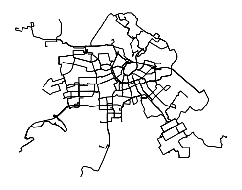

## 'Snap Realtime Data Points' 

- Snap interpolated GTFS points (buses and trams) to their nearest GVB route lines in Amsterdam.

#### INPUT DATA: Public Transport Data Lines City 
#### INPUT DATA: Interpolated Realtime Data Agency Time 
#### OUTPUT DATA: Snapped Realtime Data Agency Time

```python

def snap_interpolated_points_to_routes(routes_gdf: gpd.GeoDataFrame, interpolated_gdf: gpd.GeoDataFrame) -> gpd.GeoDataFrame:
    """
    1 Reproject interpolated data to match routes CRS
    2 Split by mode
    3 Plot row data
    4 Snap trams, snap busses
    5 Combine and plot snapped

    Parameters:
    - routes_gdf         : GeoDataFrame of public transport routes (must include 'route_type')
    - interpolated_gdf   : GeoDataFrame of interpolated GTFS points (must include 'route_type', 'geometry')

    Returns:
    - GeoDataFrame of snapped GTFS points (deduplicated), projected in same CRS as routes_gdf
    """
    #...
    #...
    #...

    return snapped

```

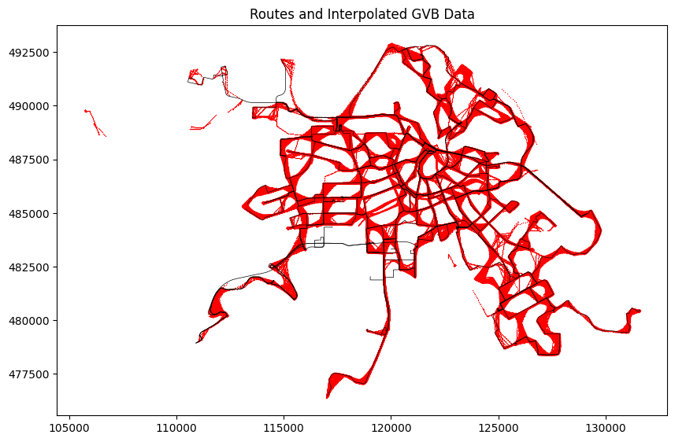

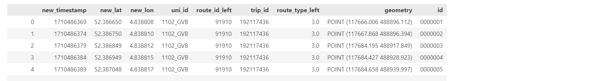

## 'Master Function Analysis and Visualisation Lines'  

- Master pipeline for processing transport and CBS data.

#### INPUT DATA: Public Transport Data Lines City 
#### INPUT DATA: CBS Full Dataset

```python

def lines_analysis(transport_gdf, cbs_gdf, buffer_distance = 50, line_number=None, transport_type=None, crs='EPSG:28992'):
    """
    1 Read and project transport data
    2 Calculate buffer
    3 Perform spatial join
    4 Generate summary statistics
    5 Concatenate summary statistics
    6 Calculate and compare sums
    7 Normalize statistics

    Parameters:
    - transport_filepath : path to transport data file
    - cbs_filepath : path to CBS shapefile
    - buffer_distance : buffer size in meters
    - line_number : specific line number(s) to filter (optional)
    - transport_type : filter by transport mode (optional)
    - crs : coordinate reference system for processing (default 'EPSG:28992')

    Returns:
    - sums_df : DataFrame comparing sums between total and sensed areas
    - gdf_projected : filtered and projected transport GeoDataFrame
    - cbs_gdf : CBS GeoDataFrame
    - joined_gdf : CBS joined with transport buffer
    - average_stats : normalized summary statistics
    """
    return sums_df, gdf_meters, cbs_gdf, gdf_projected, joined_gdf, average_stats
```

- Master function for visualizing data comparisons.

```python
def lines_visualisation(gdf_projected, cbs_gdf, joined_gdf, ams_gdf, sums_df, average_stats, buffer_distance = 50, transport_type=None, line_number=None):
    """
    1 Plot the map (fig1)
    2 Plot sums and percentages stacked (fig2)   
    3 Plot pp difference (fig3)
    4 Plot pie chart comaprison (fig4)

    """

    return fig1, fig2, fig3, fig4
```

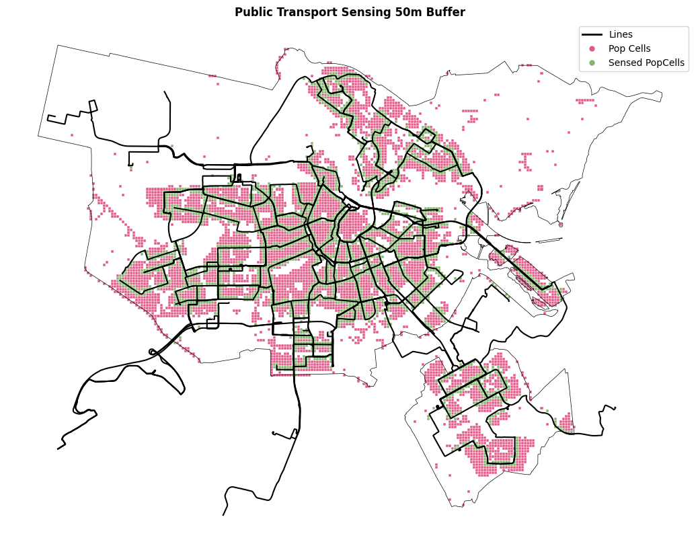
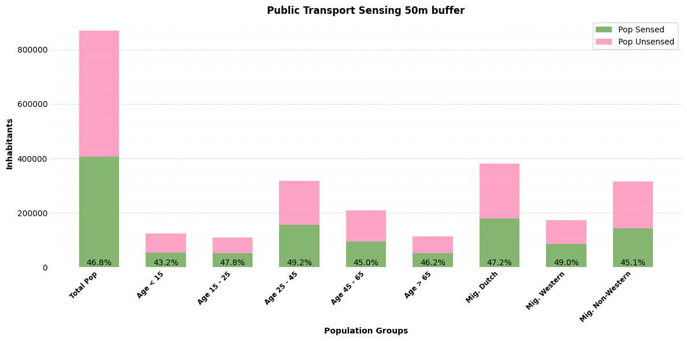
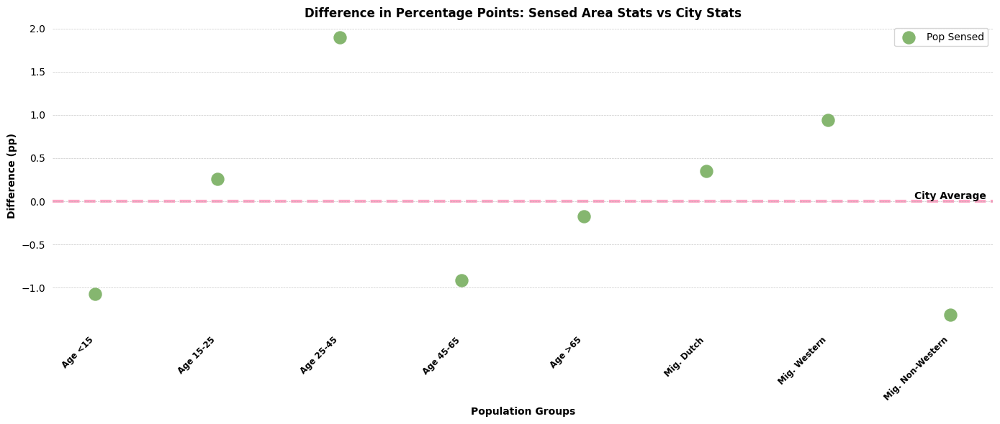
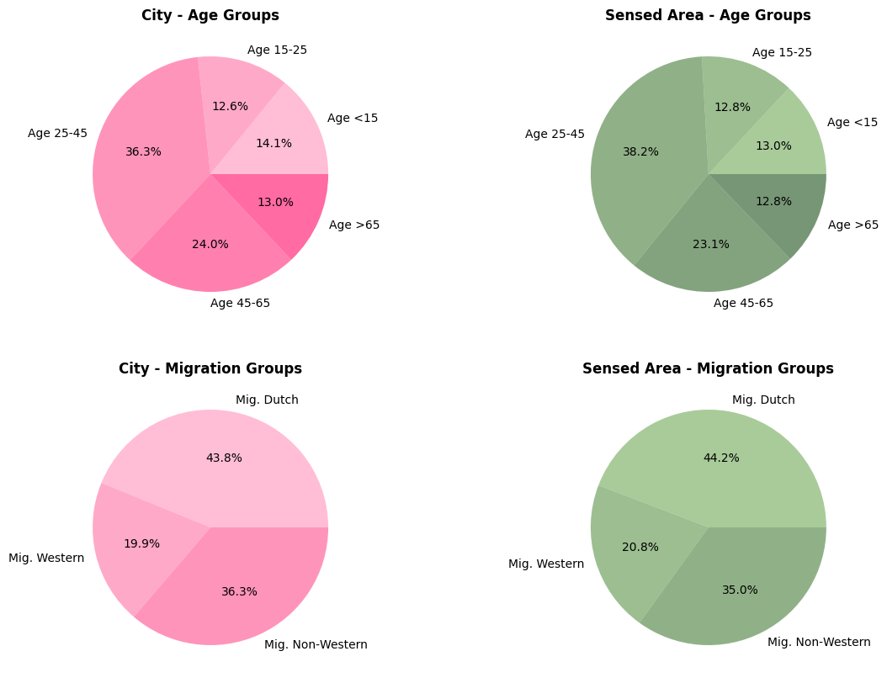

## 'Add Stats for each Line'

### INPUT DATA: Public Transport Data Lines City 
### INPUT DATA: CBS Full Dataset


```python

def line_statistics_pipeline(gdf_projected, transport_gdf, cbs_gdf, buffer_distance=50, crs='EPSG:28992'):
    """
    Full pipeline to process line statistics:
    1. Aggregate line statistics.
    2. Extract city-level statistics.
    3. Calculate inhabitants per line.
    4. Prepare average line statistics.

    Parameters:
    - gdf_projected : filtered transport GeoDataFrame
    - transport_filepath : path to transport data file
    - cbs_filepath : path to CBS shapefile
    - buffer_distance : buffer size (default 50)
    - crs : coordinate reference system (default EPSG:28992)

    Returns:
    - lines_stats : final prepared average line statistics DataFrame
    """
    return lines_stats
```

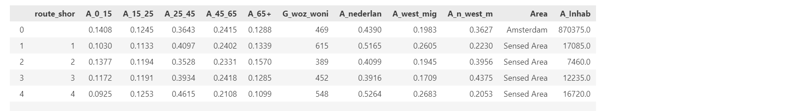

## 'LINES FAIRNESS CALCULATION AND PLOTS' 

- Only for migration or for all (including migration, age and WOZ value) 

### INPUT DATA: City Border  
### INPUT DATA: Public Transport Lines 
### INPUT DATA: Average Line Stats 

- For Migration
- 
```python
def migration_fairness_lines(lines_average_df, lines_gdf, ams_gdf, top_n=5, columns = None):
    """
    Pipeline for migration fairness analysis:
    1. Scatter plot of migration groups.
    2. Find closest lines based on migration composition.
    3. Plot fairness map (all lines).
    4. Plot top N fairest lines.
    """
    return closest_mig, migration_plot_fig, fairness_lines_mig_fig, top_fair_lines_mig_fig
```
- For all
  
```python
def all_fairness_lines(lines_average_df, lines_gdf, ams_gdf, columns = None,  top_n=10):
    """
    Pipeline for overall fairness analysis (all attributes: age, migration, WOZ):
    1. Find closest lines based on full socio-demographic and housing profile.
    2. Plot fairness map (all lines).
    3. Plot top N fairest lines.

    """
    return closest_all, fairness_lines_fig, top_fair_lines_fig
```
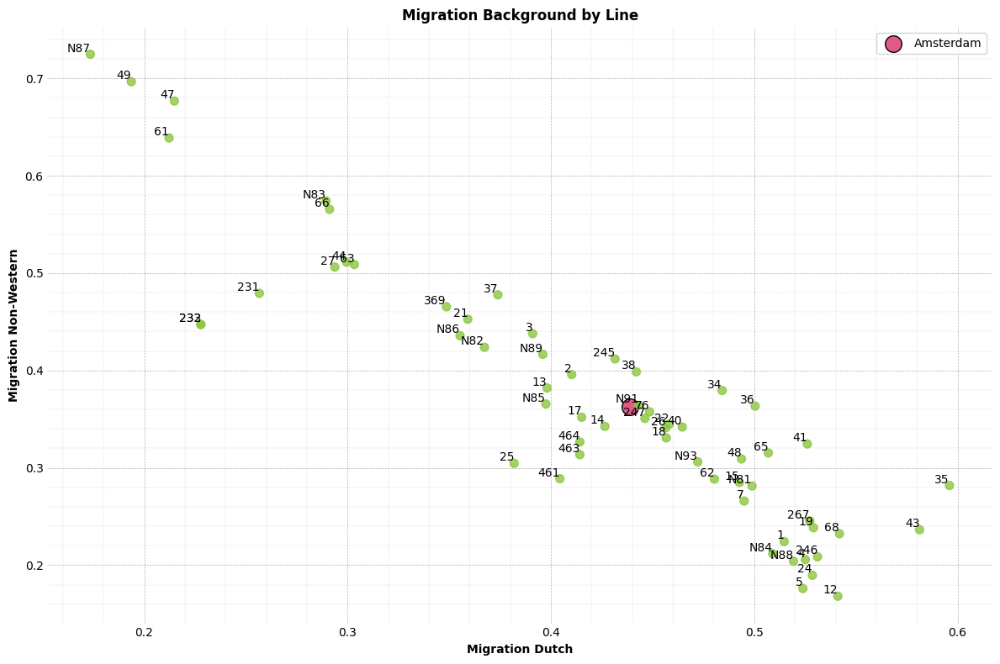
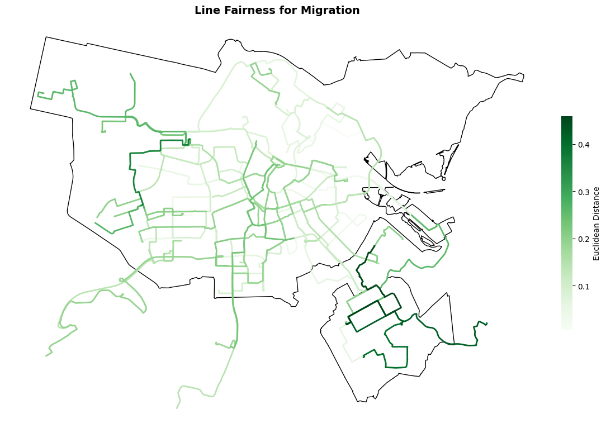
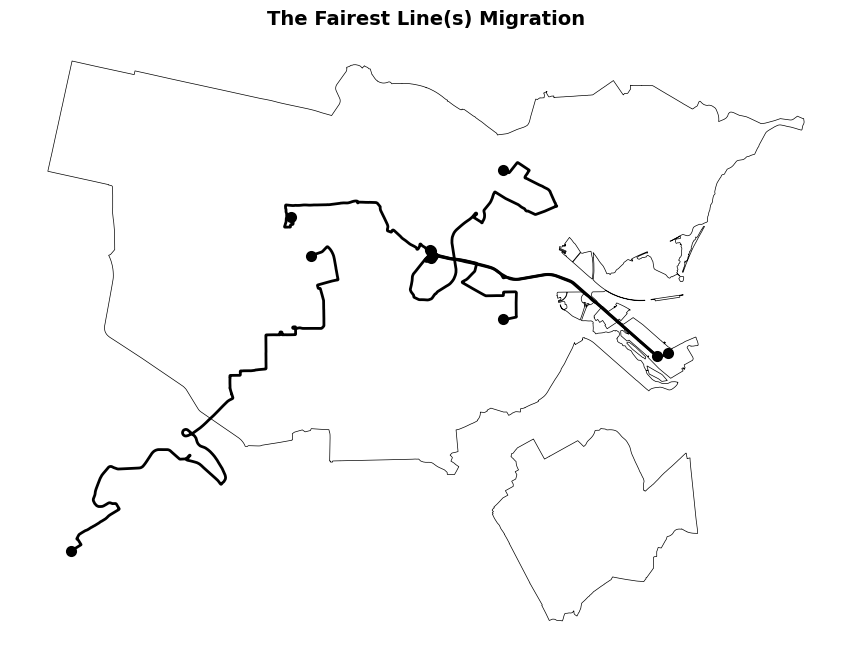

## 'Group by points with CVB and calcualte freqency' 


### INPUT DATA: CBS_GDF FULL CLEANED
### INPUT DATA: POINTS_SNAPPED (Agency, Timeframe)
### OUTPUT DATA: GRUOPED BY POINTS (CBS lists, intervals)
### OUTPUT DATA  CBS INTERVAL COUNS (Per CBS)

#### Group by GTFS realtime Points
- Grouped by ID and for each list of covering (with buffer) CBS cells

#### Add Interval column for time
- Get frequency (amount of measurements) of points in CBS cells

```python
def process_realtime_with_cbs(gdf_cbs: gpd.GeoDataFrame, points_realtime: gpd.GeoDataFrame, buffer_size: float = 50):
    """
    Full in-memory pipeline to process realtime snapped points to CBS aggregation.

    Steps:
    1. Prepare points and assign IDs.
    2. Create buffer around points.
    3. Perform spatial join to find intersections with CBS cells.
    4. Finalize intersections (add geometry, intervals).
    5. Group by CBS cells and intervals.

    Parameters:
    - gdf_cbs : GeoDataFrame of CBS cells with 'crs28992' and 'geometry'
    - points_realtime : GeoDataFrame of snapped points
    - buffer_size : buffer distance in meters (default 50)

    Returns:
    - grouped_by_points : DataFrame with intersected points, intervals, geometry
    - cbs_interval_counts : GeoDataFrame with counts per CBS cell and intervals
    """
    return grouped_by_points, cbs_interval_counts
```

Grouped by Point Dataframe 
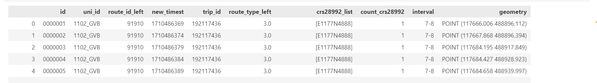

Interval Count per CBS cell
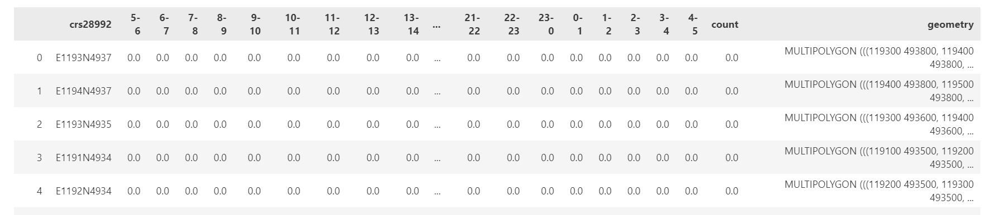

