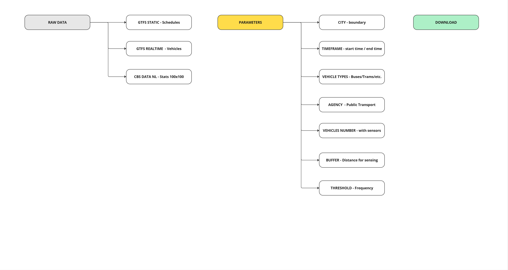
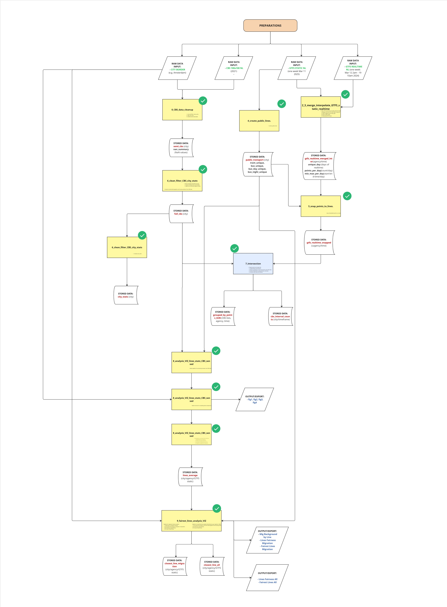
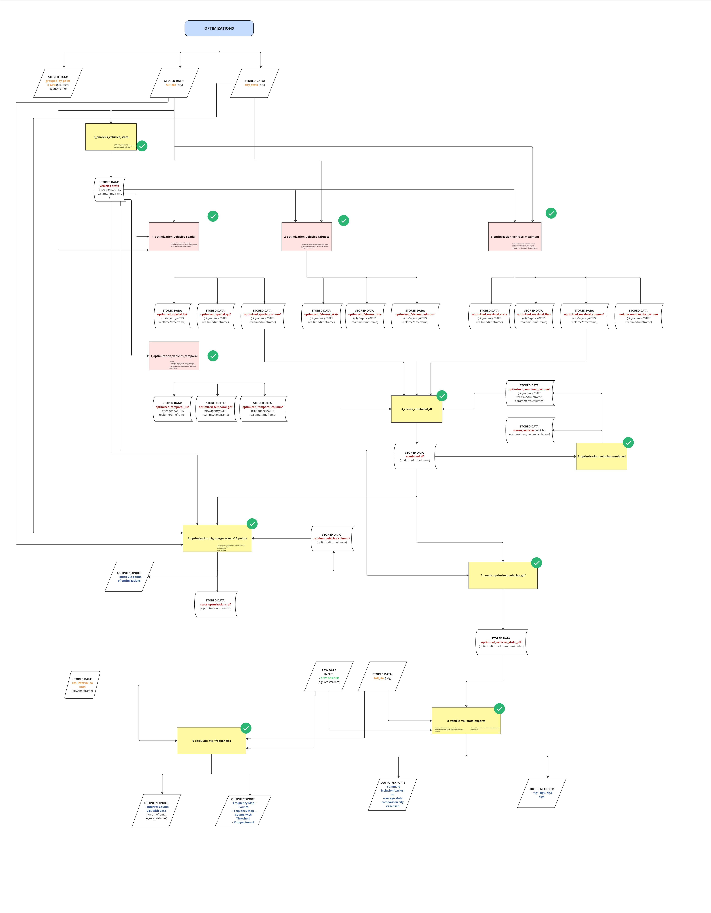

# Fair Sensing

Fair Sensing is a Python toolkit for optimizing the deployment of limited number of sensors on public transport vehicles to maximize environmental sensing potenital for different metrics such as spatial and population coverage, frequency and sociodemographic fairness. It provides a modular pipeline to prepare, compute, and visualize multiple optimization strategies across urban geographies using GTFS data, CBS (Statistics Netherlands) grids, and spatial analysis and visualization techniques.

---

📄 Research Title   **All-inclusive Public Transport – Optimization for Equitable Sensing for Amsterdam (and other Dutch cities)**  | *with P. Koljensic, T. Venverloo, F. Duarte, R. Vrijhoef*


## 💡 Key Features

-   Apply multiple strategies: spatial, temporal demographic, fairness
-   Analyze demographic equity: e.g. % youth, elderly, Dutch/non-western migrants
-   Export full sensing coverage and vehicle deployment stats 
-   Compatible with GTFS-static, GTFS-realtime and CBS 100x100m grid data

## 📁 Repository Structure

**fair_sensing/**

├── data/                        # Input data: GTFS, CBS, boundary files

├── Optimization/               # All vehicle optimization strategy scripts
  - analysis_vehicles_stats.py
  - calculate_VIZ_frequencies.py
  - create_combined_df.py
  - create_optimized_vehicles_gdf.py
  - optimization_big_merge_stats_VIZ_points.py
  - optimization_vehicles_spatial.py
  - optmization_vehicles_temporal.py
  - optimization_vehicles_maximum.py
  - optimization_vehicles_fairness.py
  - vehicle_VIZ_stats_exports.py

├── Preparation/                # Preprocessing of CBS grids, GTFS and lines
  - analysis_viz_lines_stats_cbs_sensed.py
  - cbs_data_cleanup.py
  - clean_filter_cbs_city_stats.py
  - create_public_lines.py
  - fairest_lines_analysis_viz.py
  - intersection_points_cbs_frequency.py
  - merge_interpolate_gtfs_static_realtime.py
  - snap_points_to_lines.py

├── notebooks/                  # Notebooks for fast analysis
  - prep_notebook.ipynb
  - opti_notebook.ipynb
  - viz_notebook.ipynb
  - prep_notebook_3days.ipynb
  - prep_notebook_7days.ipynb
  - opti_notebook_3days.ipynb
  - opti_notebook_random.ipynb #Dataframes for research
  - opti_notebook_summary.ipynb #Dataframes for research
  - research_notbook.ipynb #Exports for the research paper

├── .gitignore

├── requirements.txt

└── README.md

## ⚙️ Installation

Clone the repository and install required dependencies:

```bash
git clone [https://github.com/your-org/Fair_Sensing.git](https://github.com/your-org/Fair_Sensing.git)
cd Fair_Sensing
pip install -r requirements.txt
`````
#Replace your-org with your GitHub username or organization name.

## Data

The following files are included as raw (starting) data:

- 🗺️ `bounding_box.geojson` – Spatial extent for clipping (city) 
- 🧱 `cbs_vk100_2021_vol.gpkg` – CBS 100x100m grid data (Netherlands) | [source CBS](https://www.cbs.nl/nl-nl/longread/diversen/2022/statistische-gegevens-per-vierkant-2021-2020-2019)
- 📊 `city_stats_amsterdam.csv` – Demographic statistics (city) | [source CBS](https://www.cbs.nl/nl-nl/longread/diversen/2022/statistische-gegevens-per-vierkant-2021-2020-2019)
- 🧭 `gemeente_T.*` – Shapefile set for municipal boundaries (city) | [source Gemeente Amsterdam](https://maps.amsterdam.nl/open_geodata/)
- 🌐 `Gemeente2.geojson` – GeoJSON version of municipality polygons (city) | [source Gemeente Amsterdam](https://maps.amsterdam.nl/open_geodata/)
- 🚋 `gtfs_realtime_data_12_to_19.xlsx` – Preprocessed GVB GTFS-realtime data | [source GTFS Realtime Feed](https://developers.google.com/transit/gtfs-realtime)
- 🚌 `gtfs-nl.zip` – GTFS-static data for Dutch transit (zipped) |  [source GTFS OV NL](https://gtfs.ovapi.nl/)
- 💧 `water_amsterdam.gpkg` – Water bodies layer for map visualization | [source OpenStreepMap](https://www.openstreetmap.org/)

The required GTFS (General Transit Feed Specification) Static + Reltime and CBS (Statistics Netherlands) grid data for running Fair Sensing can be downloaded from the following link:

👉[**Download Data Here**](https://drive.google.com/drive/folders/1fw-R5vkeoFkxOWzpoEpzCw2sKcKDJV6D?usp=drive_link)

Please download the data and place it in the `data/` directory of the Fair_Sensing_Repo to run the toolkit.

If you want to speed up the processing time of preparation and optimization scripts, there are preprocessed datasets available here:

👉 [**Download Preprocessed Datasets**](https://drive.google.com/drive/folders/1bclSHPW3tyJIaa-wzkbg9RF1gmw9vXaF?usp=sharing)

Alternatively, Fair Sensing is designed to be flexible. You can also use your own GTFS and GTFS-realtime data, placing it within the `data/temp` directory and ensuring the file names are consistent with the expected input formats for the scripts. This allows you to analyze specific datasets and real-world scenarios as you wish.

## 📊 Workflow Overview

Below are key flowcharts describing the logic and process of Fair Sensing:

**💾 Parameters, Data & Download**


**🧹 Preparation Pipeline**


**🚦 Optimization, Freq & Vis Pipeline**


## 🚀 How to Use

### 1. 📊 Data Preparation  
Prepare GTFS and CBS data for analysis:

```bash
python Preparation/cbs_data_cleanup.py
python Preparation/merge_interpolate_gtfs_static_realtime.py
`````

### 2. 🧠 Run Optimization Strategies

Each script implements a specific logic:

-   **Spatial coverage:** `optimization_vehicles_spatial.py`
-   **Temporal coverage:** 'optmiziation_vehicles_temporal.py'
-   **Maximize population sensing:** `optimization_vehicles_maximum.py`
-   **Fairness-based matching:** `optimization_vehicles_fairness.py`
-   **Combine outputs:** `create_combined_df.py`

Example:

```bash
python Optimization/optimization_vehicles_spatial.py
`````

### 3. 📈 Analysis & Export

Analyze statistics and export visual-ready outputs:

```bash
python Optimization/analysis_vehicles_stats.py
python Optimization/calculate_VIZ_frequencies.py
python Optimization/vehicle_VIZ_stats_exports.py
`````

### 4. 🧪 Notebooks

Use notebooks for interactive workflows:

-   `prep_notebook.ipynb`: Clean and prepare CBS and GTFS
-   `opti_notebook.ipynb`: Run optimization strategies
-   `viz_notebook.ipynb`: Visualize outputs and maps
-   `freq_notebook.ipynb`: Calculate and visualize frequency 
-   `*_3days.ipynb`, `*_7days.ipynb`: Extending and running for multiple days
-   `opti_notebook_random.ipynb`, `opti_notebook_summary.ipynb`: Create dataframes for research article 
-   `research_notebook.ipynb`: Make visualizations for research article (ex. *research_notebook_random*)

## 📄 License

This project is licensed under the [MIT License](https://opensource.org/licenses/MIT).
