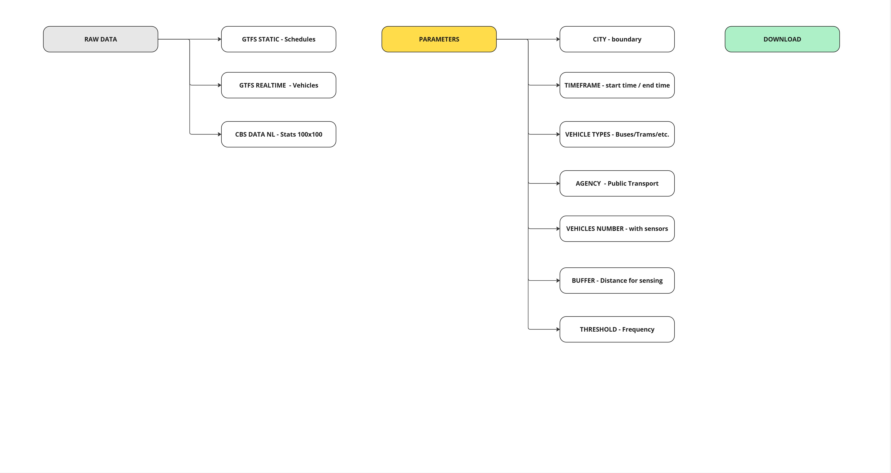
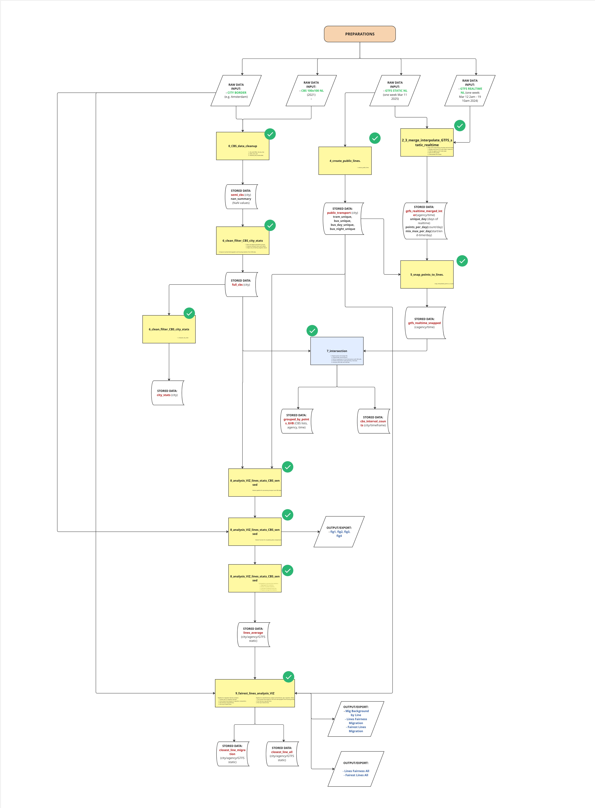
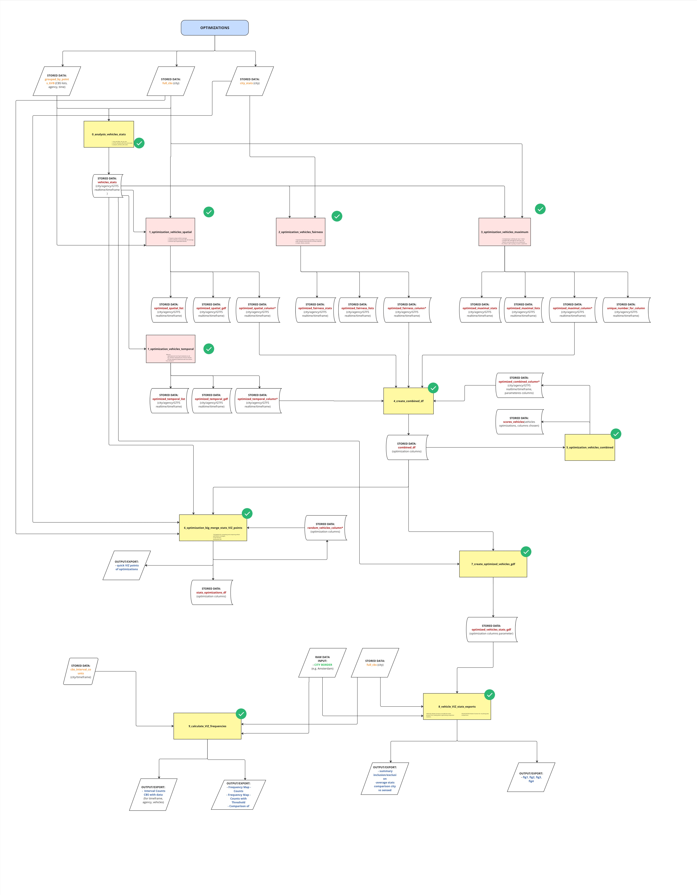

# Fair Sensing

Fair Sensing is a Python toolkit for optimizing the deployment of a limited number of sensors on public transport vehicles for environmental sensing. The workflow supports spatial coverage, temporal measurement frequency, population coverage, and sociodemographic representativeness using GTFS data, CBS (Statistics Netherlands) 100 × 100 m grids, and spatial analysis methods.

---

📄 Research title: **Fair sensing: optimizing environmental sensing deployments on public transport to cover broader demographics in Amsterdam**  
Authors: P. Koljensic, T. Venverloo, R. Vrijhoef, F. Duarte, C. Ratti

This `scientific-reports` branch contains the code used for the revised Scientific Reports manuscript. The archived repository version is available via Zenodo: **https://doi.org/10.5281/zenodo.22032018**.

## 💡 Key Features

- Apply spatial, temporal, population, and fairness-oriented vehicle selection strategies.
- Quantify sociodemographic representativeness using standardized Euclidean distance across selected demographic and socioeconomic variables.
- Compare cumulative representativeness with unique spatial population coverage.
- Evaluate measurement-frequency thresholds for environmental sensing.
- Export sensing coverage, vehicle-level statistics, and visualization-ready outputs.
- Work with GTFS-static, GTFS-Realtime, and CBS 100 × 100 m grid data.

## Scientific Reports revision

The revised analysis includes several methodological updates used in the manuscript:

- Fairness is operationalized as sociodemographic representativeness rather than as a broader measure of social or environmental justice.
- The fairness metric uses standardized Euclidean distance so variables with different numerical scales do not dominate the result.
- One reference category is omitted from each compositional demographic block when calculating the distance, while all categories remain available for descriptive reporting.
- Mahalanobis distance is available as a robustness check for correlations between dimensions.
- Cumulative and unique representation are reported separately to distinguish repeated sensing along overlapping routes from the unique spatial footprint reached by sensors.
- One-week optimization comparisons use a common eligible vehicle pool across the spatial, temporal, and fairness strategies.
- Additional sensitivity analyses cover WOZ imputation, candidate-pool restrictions, and measurement-frequency thresholds.

## 📁 Repository Structure

```text
fair_sensing/
├── Preparation/              # CBS, GTFS and spatial preprocessing
├── Optimization/             # Vehicle optimization and evaluation methods
│   ├── optimization_vehicles_spatial.py
│   ├── optimization_vehicles_temporal.py
│   ├── optimization_vehicles_maximum.py
│   ├── optimization_vehicles_fairness.py
│   ├── revised_fairness_evaluation.py
│   ├── sensitivity_analysis.py
│   ├── calculate_VIZ_frequencies.py
│   ├── analysis_vehicles_stats.py
│   └── vehicle_VIZ_stats_exports.py
├── Visualisation_Data/       # Summary datasets used for visualisation
├── prep_notebook.ipynb       # Data preparation workflow
├── opti_notebook.ipynb       # Optimization workflow
├── frequency_notebook.ipynb  # Frequency and threshold analysis
├── random_notebook.ipynb     # Random-selection analysis for the paper
├── viz_notebook.ipynb        # Visualisation workflow
├── intransit_viz.R           # Research visualisations and summaries
├── PREP_PIPELINE.md
├── OPTI_PIPELINE.md
├── requirements.txt
└── README.md
```

## ⚙️ Installation

Clone the repository and install the required dependencies:

```bash
git clone https://github.com/PeterKammLab/fair_sensing.git
cd fair_sensing
git checkout scientific-reports
pip install -r requirements.txt
```

## Data

The analysis uses GTFS-static, GTFS-Realtime, municipal boundary data, and CBS 100 × 100 m population-grid data. Because several raw and intermediate datasets are too large for the repository, they are provided separately.

👉 [Download input data](https://drive.google.com/drive/folders/1Syc8wixeNlkNNIpqa5zViHflKfKdR2Dl?usp=drive_link)

👉 [Download preprocessed datasets](https://drive.google.com/drive/folders/1hv7WDF4EGc7FlyPk4ohoI1-mw4Ern0-j?usp=sharing)

Place the downloaded data in the expected `data/` paths before running the workflows. The code can also be adapted to other compatible GTFS and GTFS-Realtime datasets.

Main source datasets include:

- `cbs_vk100_2021_vol.gpkg` – CBS 100 × 100 m grid data for the Netherlands.
- `city_stats_amsterdam.csv` – Amsterdam demographic summary statistics.
- `gemeente_T.*` / `Gemeente2.geojson` – Amsterdam municipal boundaries.
- GTFS-static schedules and GTFS-Realtime vehicle-location feeds.
- `water_amsterdam.gpkg` – water layer used in map visualisation.

## 📊 Workflow Overview

**Parameters, Data & Download**  


**Preparation Pipeline**  


**Optimization, Frequency and Visualisation Pipeline**  


For more detail, see [PREP_PIPELINE.md](./PREP_PIPELINE.md) and [OPTI_PIPELINE.md](./OPTI_PIPELINE.md).

## 🚀 How to Use

### 1. Data preparation

```bash
python Preparation/cbs_data_cleanup.py
python Preparation/merge_interpolate_gtfs_static_realtime.py
```

### 2. Optimization strategies

- Spatial coverage: `Optimization/optimization_vehicles_spatial.py`
- Temporal coverage: `Optimization/optimization_vehicles_temporal.py`
- Maximum population coverage: `Optimization/optimization_vehicles_maximum.py`
- Fairness / sociodemographic representativeness: `Optimization/optimization_vehicles_fairness.py`

Example:

```bash
python Optimization/optimization_vehicles_spatial.py
```

### 3. Analysis and export

```bash
python Optimization/analysis_vehicles_stats.py
python Optimization/calculate_VIZ_frequencies.py
python Optimization/vehicle_VIZ_stats_exports.py
```

### 4. Notebooks

The notebooks provide interactive versions of the main workflows:

- `prep_notebook.ipynb` – prepare CBS and GTFS data.
- `opti_notebook.ipynb` – run optimization strategies.
- `frequency_notebook.ipynb` – calculate hourly frequency and threshold sensitivity.
- `random_notebook.ipynb` – generate random-selection comparison outputs for the paper.
- `viz_notebook.ipynb` – create maps and other visual outputs.

## 📄 License

This project is licensed under the [MIT License](https://opensource.org/licenses/MIT).